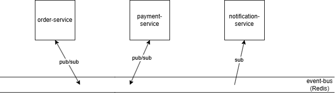

# event-driven-microservices-lite
A small system of independent services communicating via events to simulate a real production-style architecture.

**Implements:**
* service separation
* async communication
* message queue
* fault handling basics

## Start up the system
In the root run the following: 
```
docker compose build
```
```
docker compose up
```

## Submit an example order
With the system running, run the following:
```
curl -X POST http://localhost:3001/orders \
  -H "Content-Type: application/json" \
  -d '{"amount":50}'
```

## Close down the system
In the root run the following: 
```
docker compose down
```

## Simplified System Design

